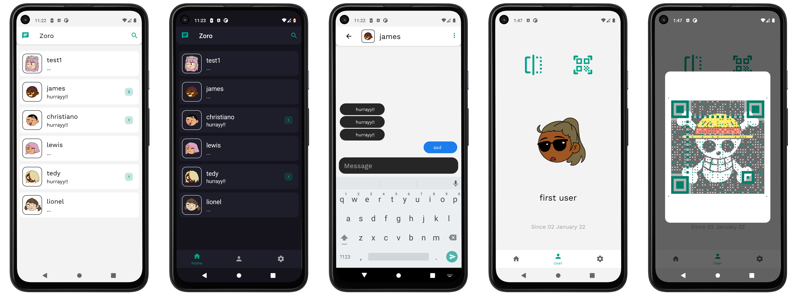
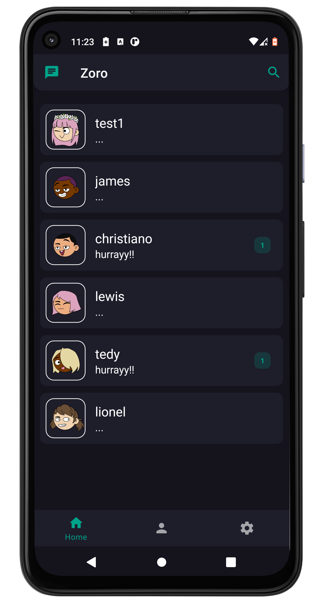
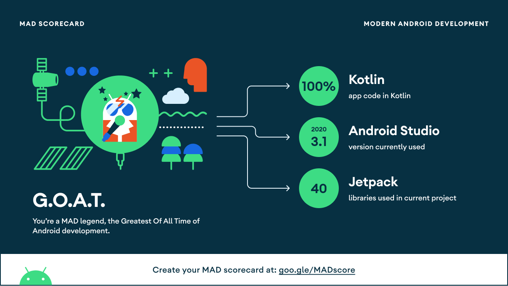

# Zoro

<p align="center">
  <a href="https://devlibrary.withgoogle.com/products/android/repos/skydoves-pokedex"></a><br>
  <a href="https://opensource.org/licenses/Apache-2.0"></a>
  <a href="https://android-arsenal.com/api?level=27"></a>
  <a href="https://github.com/sarafanshul/Zoro/actions"></a> 
</p>

<p align="center">  
Zoro is an secure chat application based on <a href="https://www.amqp.org/">AMQP</a> for pub-sub service ,<a href="https://github.com/sarafanshul/luffy/">Luffy</a> for secure backend and utilizes MVVM architecture.<br>This project uses Hilt of implementing dependency injection.<br>
Also fetching data from the network and integrating persisted data in the database via repository pattern.
</p>
<br>

<p align="center">

</p>

## Download
Go to the [Releases](https://github.com/sarafanshul/Zoro/releases) to download the latest package.




## Tech stack & Open-source libraries
- Minimum SDK level 29
- [Kotlin](https://kotlinlang.org/) based, [Coroutines](https://github.com/Kotlin/kotlinx.coroutines) + [Flow](https://kotlin.github.io/kotlinx.coroutines/kotlinx-coroutines-core/kotlinx.coroutines.flow/) for asynchronous.
- [Hilt](https://dagger.dev/hilt/) for dependency injection.
- JetPack
	- Lifecycle - dispose of observing data when lifecycle state changes.
	- ViewModel - UI related data holder, lifecycle aware.
	- Room Persistence - construct a database using the abstract layer.
- Architecture
	- MVVM Architecture (View - DataBinding - ViewModel - Model)
	- [Datastore](https://developer.android.com/topic/libraries/architecture/datastore) - Uses Kotlin coroutines and Flow to store data asynchronously, consistently, and transactionally..
	- Repository pattern
- [Retrofit2 & OkHttp3](https://github.com/square/retrofit) - construct the REST APIs and paging network data.
- [Glide](https://github.com/bumptech/glide), [GlidePalette](https://github.com/florent37/GlidePalette) - loading images.
- [Timber](https://github.com/JakeWharton/timber) - logging.
- [Material-Components](https://github.com/material-components/material-components-android) - Material design components like ripple animation, cardView.

UI is utilising a dual-theme approach, allowing users to choose from light or dark theme. Components from Material Design library (MaterialCardview, MaterialToolbar, BottomNavigationView etc.) have been used due to their ability to switch between colour Primary and colour Surface. Detail Fragments are designed in a way that allows the user to drag and move contents - this behaviour is implemented by using MotionLayout. MaterialContainerTransform (shared element transitions), MaterialFadeThrough and MaterialElevationScale from Material Design library have been used to animate transitions between list and detail fragments.

## How to setup :
- Backend
	- Clone [Luffy](https://github.com/sarafanshul/Luffy) for backend (not necessary if using compose).
	- If not cloned , copy the `compose file` from [docker/anshulsaraf/luffy](https://hub.docker.com/repository/docker/anshulsaraf/luffy) into a folder
	- Make sure [Docker](https://www.docker.com/) is running .
	- `cd` inside the folder where `compose file` is saved and run `docker compose up`
	- Now your backend should be up
- Frontend
	- Inside `NetworkingConstants.kt` configure your backend constants
	- Replace the keystore  from `app/keystore/ZoroKeyStore.jks`with your signed one.
	- Setup Detekt (not forced but recommended)
	- Setup Configs in `local.properties`
- Android Studio specific
	- Invalidate Cache (just to be safe)
	- Build and add magic

## MAD Score



## Architecture
NarutoDex is based on MVVM architecture and a repository pattern.


## Authors
[Anshul](https://github.com/sarafanshul)

## Find this repository useful? :heart:
__[follow](https://github.com/sarafanshul)__ me for my next creations! 🤩

# License
```xml
Designed and developed by 2020 sarafanshul (Anshul Saraf)

		Licensed under the Apache License, Version 2.0 (the "License");
		you may not use this file except in compliance with the License.
		You may obtain a copy of the License at

		http://www.apache.org/licenses/LICENSE-2.0

		Unless required by applicable law or agreed to in writing, software
		distributed under the License is distributed on an "AS IS" BASIS,
		WITHOUT WARRANTIES OR CONDITIONS OF ANY KIND, either express or implied.
		See the License for the specific language governing permissions and
		limitations under the License.
```
